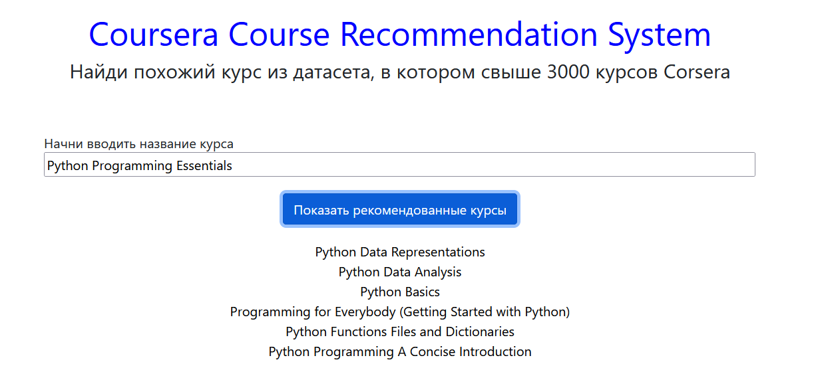

# Рекомендательная система для онлайн курсов
Проект разработан в ходе курса по большим данным в УлГУ.

### ML модель
Content-based filtering and cosine_similarity.

### Сайт
Использован фреймворк Flask.

Начальная страница

При вводе autocomplete из массива курсов

Результат

